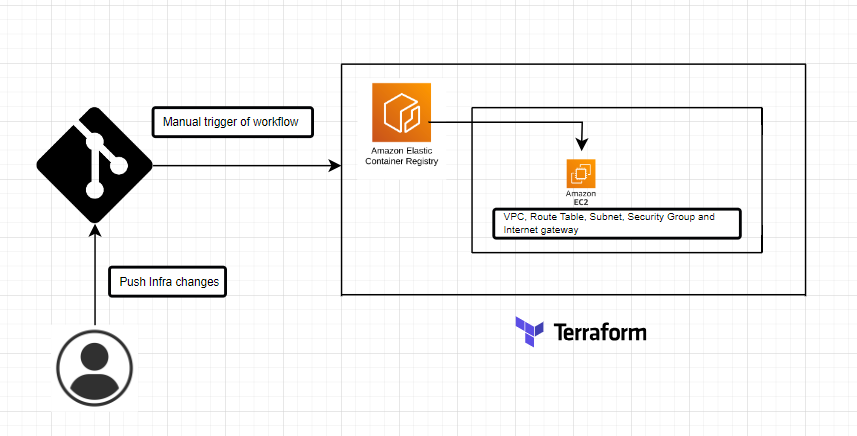

# Contineous Delivery of Containerised Webapp

This repository represents the Continuous Delivery (CD) part of a containerized web application. I am using terraform to build and deploy the containerised webapp. It utilizes GitHub Actions to build a terraform code and save the plan. Once the plan is verified we can manually trigger the deployment

## Deploy Containerized application on AWS

### Various options for deploying static website on cloud

* Amazon Elastic Container Service (ECS). For container orchestration with minimal infrastructure management.
* Amazon Elastic Kubernetes Service (EKS)
* AWS App Runner
* AWS Lambda serverless functions
* Amazon Lightsail
* Custom EC2 Instances

### Choice

After considering factors like application requirements, application complexity and deployment criteria, I have opted to deploy the hello world on Custom EC2 Instace.

## Architecture



### Prerequisites

* AWS Account: You need an AWS account
* GitHub Secrets: Store the required credentials in GitHub Secrets
* AWS_ACCESS_KEY_ID
* AWS_SECRET_ACCESS_KEY
* AWS_REGION
* ECR_REPOSITORY

### Instructions to Provision Environment

* Clone the Repository: Clone this repository to your local machine.
* Modify the terraform scrits if rquired
* Commit Your Changes: After making changes, commit them to the repository.
* CD Workflow: When you push the changes to the repository, GitHub Actions will automatically trigger the terraform plan and save it. you need to manually trigger the deployment after verifying the plan. This is to have controlled deployemnt of infrastructure

## Terraform as IaC to provision the infrastructure and deploy container image

I have used terraform as IaC tool to provision infrastructure. Some of the features that are considered while creating the modules

- Re-usable modules where most of the attributes are defined as variables and can be provided either during runtime or by providing terraform.tfvar files
- CD pipeline includes infrastructure provisioning, where the terraform plan is prepared and uploaded to an artifact repository.
The deployment workflow is triggered manually after reviewing the Terraform plan (tfplan). This allows for greater control and review before deployment.
- Access Key Management: Initially, the creation of access keys does not include validation, Hence, we need to destroy teh infrastructure on every run. However, This should be improved by storing the generated access keys in a vault or S3 for later use, such as validating the key before creation
- Terraform State Management: The Terraform state file should be stored in S3 or a vault, rather than locally, to follow best practices. The backend.tf file should look like this:

    ```
      terraform {
        backend "s3" {
          bucket         = "<bucket-name>"
          key            = "path/to/terraform.tfstate"
          region         = "us-east-1"
          encrypt        = true
        }
      }
    ```
- Separation of Infrastructure and Application Deployment: It is a good practice to keep the deployment of applications separate from infrastructure provisioning. Tools like Ansible, Chef, or Puppet can be used to bring nodes to the desired state and deploy applications.For simplicity, in this project, the deployment is included during environment creation. However, the best approach is to Provision the environment, Verify the state (by downloading the state file from the backend).Deploy the container using Chef/Ansible/Puppet, including logic to verify the container/image version, safely stop the container, deploy, and bring the node to the desired state.
